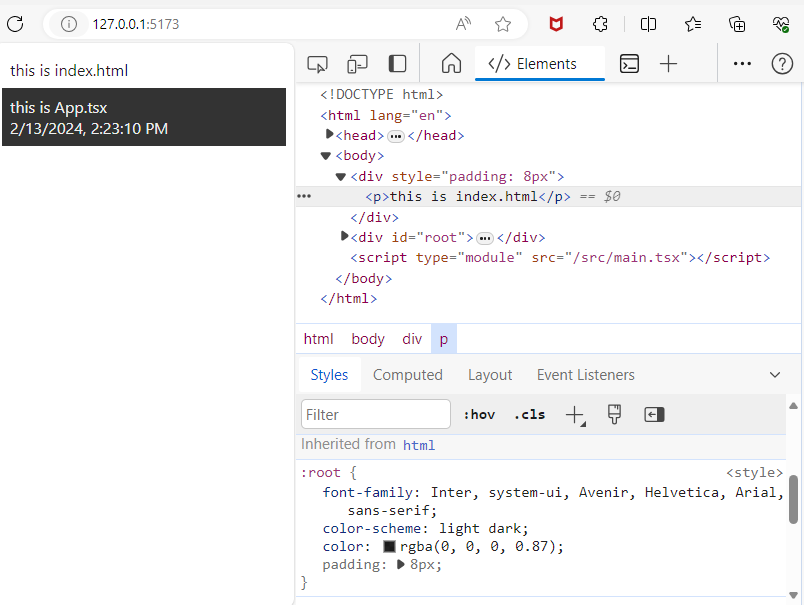

# サーバーサイドレンダリング完全に理解したので仮説検証してみた [Next.js]

## 概要

Next.js はリクエストを受け、サーバーサイドレンダリングを行い、レスポンスを受け取ったブラウザはハイドレーションを行い、その後はブラウザ上で再描画が行われる。  
つまり、ブラウザの JavaScript を Off にして表示した際には下記のようなことが起こるはず。  
ということを考え、検証してみた

## 目次

- [サーバーサイドレンダリング完全に理解したので仮説検証してみた \[Next.js\]](#サーバーサイドレンダリング完全に理解したので仮説検証してみた-nextjs)
  - [概要](#概要)
  - [目次](#目次)
  - [構成](#構成)
  - [つまりこういうことですよね？検証したい仮説](#つまりこういうことですよね検証したい仮説)
  - [React では JSX が一切レンダリングされない](#react-では-jsx-が一切レンダリングされない)
    - [JavaScript ON の状態 (react)](#javascript-on-の状態-react)
    - [JavaScript OFF の状態 (react)](#javascript-off-の状態-react)
  - [Next.js ではサーバーサイドレンダリングにより一部描画が行われてレスポンスされる](#nextjs-ではサーバーサイドレンダリングにより一部描画が行われてレスポンスされる)
    - [JavaScript ON の状態 (next)](#javascript-on-の状態-next)
    - [JavaScript OFF の状態 (next)](#javascript-off-の状態-next)
  - [所感](#所感)

## 構成

- [my-sample-next-app](./my-sample-next-app)
  - 検証で使用した Next.js アプリケーション
- [my-sample-react-app](./my-sample-react-app)
  - 検証で使用した React アプリケーション

## つまりこういうことですよね？検証したい仮説

JavaScript を OFF にして開いた場合

- React では JSX が一切レンダリングされない。
- Next.js ではサーバーサイドレンダリングにより一部描画が行われてレスポンスされる

## React では JSX が一切レンダリングされない

これは予想通り。  
`index.html`に記載の内容のみが表示され、`App.tsx`以下の資材は表示されていない。また、CSS も`main.tsx`から読み込まれているので、スタイルも適用されていない  
React 資材として記載された部分が全く動いていないという結果。

### JavaScript ON の状態 (react)

### JavaScript OFF の状態 (react)

## Next.js ではサーバーサイドレンダリングにより一部描画が行われてレスポンスされる

Next.js においては一部資材がサーバーサイドレンダリングされる  
下記のことを試してみた

1. レンダリング時刻の表示
2. 現在時刻を１秒ごとに再描画
3. URL search parameter に含まれた id によるデータフェッチング
4. ユーザーがプルダウンメニューで選択した id によるデータフェッチング

これらのうち、`1・3`はサーバーサイドレンダリングにより処理される。つまり、JavaScript OFF でも表示される。  
`2・4`は client component による処理なので、JavaScript OFF では表示されない。なお、client component の内部であっても、サーバーサイドレンダリングが可能なものはレンダリングされてからレスポンスされる

### JavaScript ON の状態 (next)

### JavaScript OFF の状態 (next)

## 所感

理屈を理解しようと務めることも大事。それと同時に、実際に手を動かして仮説を検証したほうが解像度が高まる
